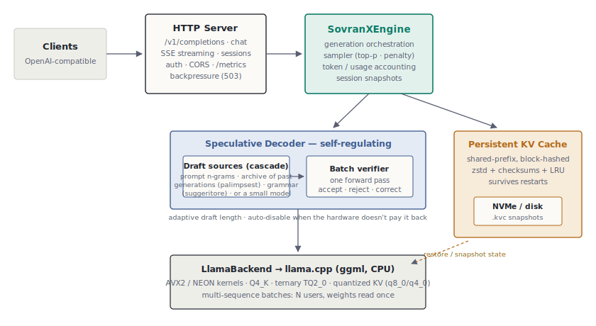
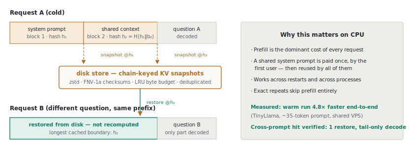
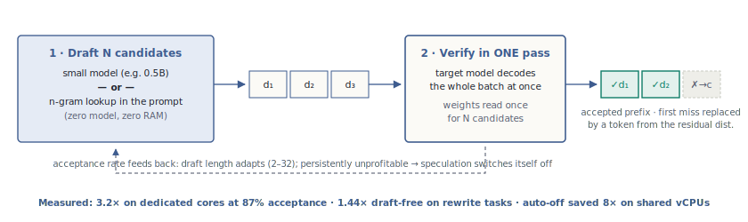

<p align="center">
  
</p>

<p align="center">
  <a href="https://swellweb.github.io/reame/"><b>▶ Try the live demo</b></a> — a real Reame instance serving an LLM from a free Oracle ARM box, in your browser.
</p>

**A lean, fully-tested LLM inference server built on [llama.cpp](https://github.com/ggml-org/llama.cpp) — designed for the hardware you already have: shared vCPUs, free tiers, 2-core ARM boxes.**

Reame is an inference server built for cheap CPU hardware first — not as a
fallback for missing GPUs. Its thesis is simple:

> **On a CPU, never compute the same thing twice.**


## What Reame is for

Reame is built for **narrow, repetitive AI workloads over your own data, on
hardware you already pay for** — the case where the answer lives in the
context you provide, not in the model's general knowledge. That is exactly
where a small model matches a frontier one (we measured 100% accuracy on
long-context extraction with a 7B on a free 2-core ARM box) and where
Reame's memory makes request #100 cost a fraction of request #1.

| Use case | Why it fits | Suggested model |
|---|---|---|
| Document extraction & classification (RAG, invoices, tickets, scraping) | answers live in the context; prompts share prefixes → the disk cache pays | OLMoE 7B-A1B |
| Batch pipelines (tag 10k products overnight, meta descriptions, email triage) | repetitive by nature → Palimpsest drafts them; €0 per token, no rate limits | Qwen2.5 1.5B–3B |
| AI features inside a thin-margin SaaS | a €5 VPS instead of a metered API keeps unit economics alive | Qwen2.5 1.5B–7B |
| Privacy-bound work (legal, medical, public sector) | data never leaves your server — full sovereignty | OLMoE 7B-A1B |
| Private code autocomplete (Continue.dev + OpenAI-compatible API) | line-level completion is a narrow task; code never leaves the laptop | Qwen2.5-Coder 1.5B |
| Judgment on your data (SEO/content audits, review triage) — in batches | needs real reasoning: we measured smaller models inventing findings; the 9B audited a live page correctly in 73s on a laptop | Qwen3.5-9B |

**What Reame is NOT for**: a
general-purpose ChatGPT replacement (frontier reasoning and broad knowledge
need frontier parameter counts), agentic coding assistants, or creative
long-form writing at scale.

- 🗂️ **Persistent shared-prefix KV cache** — prompt prefixes are snapshotted to disk
  (zstd, checksummed, LRU-budgeted) and reused **across different prompts, restarts
  and processes**. A system prompt is paid for once, by the first user.
- 📜 **Palimpsest: the server remembers what it generated** — every completed
  generation feeds an on-disk n-gram archive; future requests draft from it
  at zero cost. Domain workloads repeat themselves — let them pay off.
- 🎭 **Il Suggeritore: grammar as a draft source** — constrained decoding uses
  structure to *forbid* tokens; Reame inverts it and uses structure to
  *propose* them. List numbering, bullets and format tokens are speculated
  for free on content nobody has ever generated before.
- 🔮 **Self-regulating speculative decoding** — a small draft model *or* zero-cost
  n-gram lookup proposes tokens; the target verifies them in one batched pass.
  Reame *measures* whether speculation pays on your hardware and switches it
  off by itself when it doesn't.
- 🏛️ **The Conclave: consensus as a quality knob** — `--best-of N` generates N
  candidate answers to the same prompt in one interleaved batch (one prefill,
  cloned into the others via KV copy; every weight read shared) and elects the
  winner by majority on the final result. The moment an absolute majority
  agrees, the stragglers are stopped. Measured: it squeezes roughly
  one extra correct answer per quiz out of *the model you already run* — it
  does not make a 1.5B out-reason a 3B (consensus fixes variance, not bias).
- 👥 **Interleaved multi-user serving** — N concurrent generations advance together
  inside single multi-sequence batches, sharing every read of the model weights
  (the cost that dominates memory-bound CPU decoding).
- 🏰 **ARCA: the shared memory daemon** — `reame arca` starts a Redis-compatible
  service any language's Redis client reaches with zero SDK: an exact-response
  cache (a computed answer served in ~0.02 s vs ~1 s of inference) and a
  fleet-wide generation corpus (one node's output drafts the others'). One
  config line — `[arca] remote = host:6420` — wires a Reame node to it, and
  deterministic requests are cached automatically. Proven on a free ARM box
  with real `redis-cli`. See [docs/ARCA.md](docs/ARCA.md).
- 🌐 **OpenAI-compatible REST API** — `/v1/completions`, `/v1/chat/completions`,
  SSE streaming, sessions, bearer auth, metrics. Point any OpenAI client at it.
- ⚡ **Zero-config CLI** — `reame run qwen2.5-1.5b` downloads the model once,
  autoconfigures threads/KV/cache for the host and drops into a chat (or
  `--serve`). No config file until you want one.
- 🧪 **220+ isolated test cases** — every layer is mockable and tested without a
  model; correctness of the multi-sequence, speculative and KV-clone paths is
  pinned against real models in integration tests.



## Measured, not promised

Every number below was produced by the shipped binary on the hardware named —
including the negative results that shaped the design.

| Highlight | Measured | Machine |
|---|---|---|
| MoE beats dense on CPU | OLMoE 7B-A1B **26.7 tok/s** vs dense 7B 3.3 tok/s, same 8/8 accuracy | Oracle free (€0) |
| Warm cache vs cold | **4.8× end-to-end** | Contabo VPS |
| Generation archive (Palimpsest) | **2.3×** (22→51 tok/s) | M3 Pro |
| Judgment without hallucinating | Qwen3.5-9B: **zero invented findings**, full SEO audit in 73s | M3 Pro |
| Architecture > size | dense 27B **~0.1 tok/s** — 250× slower than a 7B MoE, same box | Oracle free |

**[Full benchmarks, methodology and negative results → docs/BENCHMARKS.md](docs/BENCHMARKS.md)**

Three negative results that matter. A 30B-class MoE on the maxed free tier answered the same extraction questions perfectly — and ten times slower than a 7B-A1B that also scored 100%: when the answer lives in the context, extra parameters buy nothing (MoE prefill touches nearly every expert, so the 3B-active discount vanishes on document reading). Use 30B-class models for hard reasoning in background batches, not for serving. On heavily oversubscribed shared vCPUs a draft
model runs as slowly as its target, so speculation is counter-productive there —
Reame detects this and disables it at runtime. And the Conclave does **not**
close the gap to a model twice the size on hard reasoning: majority voting
corrects random slips, not systematic misunderstanding — we measured a 1.5B ×5
land between the 1.5B and a 3B, never above the 3B. Benchmarks that only show
wins are advertising; these are engineering.

## How it works

**Shared-prefix disk cache.** Prompts are split into fixed token blocks; a chain
hash keys a KV snapshot at every block boundary. A *different* prompt that shares
a prefix restores the longest cached boundary and decodes only its own tail.
Unlike GPU-resident prefix caches, snapshots live on NVMe: they survive restarts.



**Self-regulating speculation.** Classic Leviathan/Chen acceptance (the rejected
token is resampled from the residual distribution, so the output distribution is
exactly the target's), with two CPU-first twists: the draft source can be free
n-gram lookup mined from the prompt itself — ideal for extraction and rewrite
workloads — and a feedback controller adapts the draft length and turns
speculation off when measured acceptance or draft economics go negative.



**The Conclave.** `--best-of N` submits N attempts at the same prompt to the
interleaved scheduler: attempt 0 is the untouched anchor (greedy stays greedy),
the explorers shift seed and heat up. The scheduler notices the identical
prompts and **clones the prompt KV** instead of prefilling N times (copy the
donor's cache, decode only the last prompt token — argmax-verified equal to a
full prefill). Election is an exact-majority vote on each candidate's final
number, with a Jaccard text-medoid fallback for prose; the moment a majority
exists the remaining candidates are stopped mid-generation, and the CLI reports
`CONCLAVE consensus=k/N` so a caller can escalate only when the conclave split.
Use it as a quality knob: more accuracy from the model your hardware can
afford, paid in idle interleaved compute rather than a bigger model's RAM.

## Quick start

```bash
reame list                                  # model catalog + what's on disk
reame run qwen2.5-1.5b                      # download once, auto-config, chat
reame run qwen2.5-1.5b "Explain mmap"       # one-shot answer
reame run qwen2.5-1.5b --serve              # OpenAI-compatible API on :8080
reame run qwen2.5-1.5b "12*13-50?" --best-of 5   # the Conclave
```

`run` resolves a catalog name (or any local GGUF path), downloads to
`~/.reame/models` on first use and picks threads, KV quantization and cache
directory for the host. A config file is only needed when you want control.

A real judgment task — the model audits a live page from its raw HTML (the
`head -c` only fits it into context; the audit is all the model's):

```bash
reame run qwen3.5-9b "Quick SEO audit of this page's HTML — title/meta \
quality, heading issues, images missing alt text, three concrete fixes:
$(curl -s https://your-site.com | head -c 16000)"
```

## Install

**Homebrew** (macOS / Linux):

```bash
brew tap swellweb/reame
brew install reame
```

**Prebuilt binaries** — Linux x64/arm64 and macOS arm64 on the
[releases page](https://github.com/swellweb/reame/releases)
(runtime dependency: libzstd).

**npm** (`npx reame`): planned — binaries are already built per platform.

## Build from source

```bash
git clone https://github.com/swellweb/reame
cd reame
git submodule update --init --depth 1 third_party/llama.cpp
./build.sh                       # Release build + full test suite

./scripts/download_models.sh     # TinyLlama (test model, ~670 MB)

./build/src/reame --config config/reame.conf --prompt "Hello" --max-tokens 32
./build/src/reame --config config/reame.conf --serve   # OpenAI-compatible API
```

Dependencies: CMake ≥ 3.16, a C++17 compiler, and for the server Boost (headers),
nlohmann-json and zstd:

```bash
# Debian/Ubuntu
sudo apt install build-essential cmake libboost-dev nlohmann-json3-dev libzstd-dev pkg-config
# macOS
brew install cmake boost nlohmann-json zstd pkg-config
```

## Configuration highlights

```ini
[model]
path = models/qwen2.5-7b-instruct-q4_k_m.gguf
context_length = 4096      # total KV budget (shared across users when parallel > 1)
threads = 4                # fewer is often faster on shared vCPUs — measure!

[memory]
kv_cache_type = q8_0       # f16 | q8_0 | q4_0 — halve/quarter context RAM

[speculative]
enabled = true
mode = lookup              # model (needs draft_model_path) | lookup (no 2nd model)

[cache]
directory = .reame-cache
max_size_mb = 4096         # LRU byte budget on disk

[server]
port = 8080
api_key =                  # bearer auth when set
parallel = 1               # >1 = interleaved multi-user serving
```

## API

| Endpoint | Description |
|---|---|
| `POST /v1/completions` | text completion (SSE with `"stream": true`) |
| `POST /v1/chat/completions` | chat completion |
| `POST /v1/sessions` · `.../save` · `.../load` · `DELETE .../{id}` | KV session snapshots |
| `GET /metrics` | request counters + speculative/cache metrics |
| `POST /v1/warm` | pre-prefill a prompt into the cache (warm-ahead) |
| `GET /health` | liveness (auth-exempt) |

## Status & scope

Reame is young and deliberately **opinionated and focused**: CPU-only serving,
one model per process, correctness pinned by tests at every layer. Not goals:
GPU offload, training, model management UX. The llama.cpp submodule is pinned to
a known-good commit and bumped deliberately.

Documentation in Italian: [docs/README.it.md](docs/README.it.md).

## Why Reame and not Ollama?

The laptop story is the same one command: `reame run qwen2.5-1.5b` downloads,
autoconfigures and chats — nothing to learn. From there the two projects
diverge: Ollama optimizes for running *many* models casually; Reame optimizes
for serving *one* workload seriously on hardware that costs nothing. The
difference is one sentence:

> Ollama runs models. Reame remembers having run them.

General-purpose servers treat every request as brand new: compute, discard,
repeat. On a GPU that's fine — compute is cheap. On a cheap CPU, compute is
the most expensive thing you have.
Everything in Reame attacks that: the disk prefix cache, the generation
archive, the grammar prompter, self-regulating speculation, interleaved
multi-user batches, the Conclave. None of it exists in Ollama.

The practical consequence: **a Reame server gets faster the longer it runs.**
The hundredth request costs a fraction of the first — the system prompt was
paid once, similar answers draft themselves from the archive, structure is
speculated for free. That property is the whole design.

## Support

Reame is free, MIT-licensed and built on nights and free-tier hardware. If it
saves you API bills or GPU rent, consider [sponsoring](https://github.com/sponsors/swellweb)
the work — sponsorships fund the roadmap: warm-ahead prefill, a semantic (L2)
cache layer for the [ARCA daemon](docs/ARCA.md), and first-class MoE serving.

## Acknowledgments

Reame stands on the shoulders of [llama.cpp](https://github.com/ggml-org/llama.cpp)
(all tensor kernels; MIT). The disk-first cache thesis was inspired by
antirez's DwarfStar4 line of thinking; the speculative pipeline by DeepSeek's
DSpark work and the Leviathan/Chen speculative sampling theorem; archive
drafting is a shipped, persistent take on retrieval-based speculation (REST);
form drafting inverts grammar-constrained decoding. Ideas are cited, numbers
are ours.

## License

[MIT](LICENSE). Built on the shoulders of [llama.cpp](https://github.com/ggml-org/llama.cpp) (MIT).
